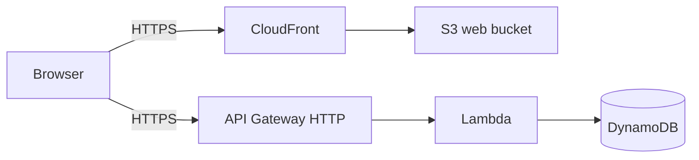
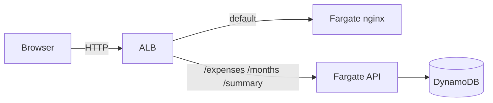
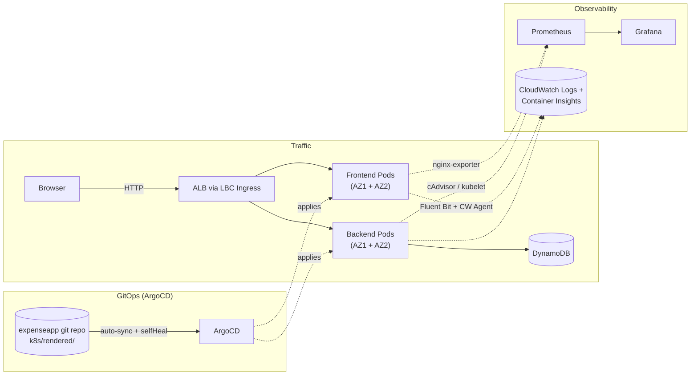

# expenseinfra — Multi-Runtime AWS Infrastructure

Terraform repository for a **personal expense tracker demo** used to design, deploy, and compare **three AWS runtime patterns** from one codebase.

The goal is not only to ship the app, but to see **serverless vs containers vs orchestration** trade-offs in a real AWS account: networking, identity, CI/CD coupling, and day-two operations.

---

## What this repo does

| Piece | Role |
|--------|------|
| **`terraform/`** | Root module: `terraform init` / `plan` / `apply` here |
| **`terraform/deployment_mode.tf`** | `lambda` \| `ecs` \| `eks` → enables exactly one `runtime-*` module |
| **`terraform/main.tf`** | Wires `shared` + `runtime-lambda` + `runtime-ecs` + `runtime-eks` |
| **`terraform/paths.tf`** | Locates **expenseapp** sources (`frontend/index.html.tpl`, `backend/lambda/handler.py`) for Lambda packaging |
| **`terraform/modules/shared/`** | **DynamoDB** (expenses table), **ECR** (backend + frontend repos), **SSM** parameter for image release counter, optional **SNS + AWS Budget** |
| **`terraform/modules/runtime-lambda/`** | API Gateway HTTP API + Lambda + S3 web bucket + CloudFront |
| **`terraform/modules/runtime-ecs/`** | ECS Fargate (API + nginx UI) + ALB path rules + CloudWatch log groups |
| **`terraform/modules/runtime-eks/`** | Dedicated VPC (2 AZs, one node group pinned per AZ), EKS cluster + node groups, IRSA roles, IAM for AWS Load Balancer Controller, **CloudWatch Observability addon** (logs + Container Insights) |
| **`.gitlab-ci.yml`** | `fmt` → `validate` → `plan` → manual **`apply`**; optional destroy-only pipeline |
| **`check-destroy-*.sh`** | Read-only AWS checks **after** destroy (not a substitute for `terraform destroy`) |

**Application UI and business logic** live in a separate **expenseapp** repository (`frontend/`, `backend/`). This repo **does not** contain the full SPA source tree except what Terraform reads for Lambda, and **does not** build Docker images (that is **expenseapp** CI).

---

## Runtime switch

Single variable in `terraform/environments/prod.tfvars` (or your tfvars):

```hcl
# Choose runtime: lambda | ecs | eks
deployment_mode = "lambda" # or "ecs" or "eks"
```

Only the matching runtime module creates resources; the others are skipped (`enabled = false` pattern).

---

## Shared layer (all modes)

`module.shared` is always applied and holds **runtime-agnostic** pieces:

- **DynamoDB** — `expenses` table (hash `user_id`, range `expense_id`).
- **ECR** — two repositories for **ECS/EKS** images (`:latest` + version tags from CI). Still created in Lambda mode so you can switch modes without recreating repos by hand (repos may stay empty until you use ECS/EKS).
- **SSM Parameter Store** — `/${project_name}/expense/image-release-seq` — **release counter for image tags** (`v001`, …), updated by **expenseapp** CI, not by Terraform after create (`lifecycle { ignore_changes = [value] }`).
- **Optional** — SNS topic + email subscription + monthly AWS Budget (see `variables.tf`).

**Not in `shared`:** Lambda-only **S3 + CloudFront** live under **`runtime-lambda`**. **Remote Terraform state** (S3 bucket + optional DynamoDB **state lock** table) are **bootstrap** resources you create **outside** this module; they are referenced in `terraform/backend.tf` and are **not** destroyed by `destroy_apply` here.

---

## Architecture diagrams (in-repo)

GitHub renders **Mermaid** in Markdown; the diagrams below show up directly on the repo home page. You do **not** have to add a PNG unless you want a slide or portfolio graphic — then Excalidraw / draw.io → export PNG and link it from here.

### Lambda (`deployment_mode = "lambda"`)



### ECS Fargate (`deployment_mode = "ecs"`)



ECS UI image is built with **empty `API_BASE`** so the browser calls the **same host** as the ALB (path-based routing).

### EKS (`deployment_mode = "eks"`)



The **AWS Load Balancer Controller** creates the internet-facing ALB from **Ingress**; it is not a fixed Terraform `aws_lb` resource like ECS. The EKS module uses a **dedicated VPC** (two AZs, one node group pinned per AZ) and **IRSA** so workloads use short-lived credentials instead of long-lived keys.

Three separate planes, each with its own access path (**none exposed publicly except the ALB**):
- **Traffic** — the only internet-facing path; everything else is `kubectl port-forward` only.
- **GitOps** — CI pushes rendered manifests to git; ArgoCD (not CI) is what actually applies them to the cluster and reverts manual drift (`selfHeal`).
- **Observability** — Prometheus/Grafana (installed by expenseapp CI) for dashboards; CloudWatch Observability addon (installed by this repo's Terraform) for logs + Container Insights, independent of the Prometheus stack.

---

## Runtime comparison

| | **Lambda** | **ECS Fargate** | **EKS** |
|---|------------|-----------------|---------|
| **Best for** | Low traffic, minimal ops | Containers without managing EC2 | Full orchestration, CRDs, team scale |
| **Compute** | Pay-per-invocation | Per-task vCPU/memory | Node groups + control plane cost |
| **Ingress** | API Gateway + CloudFront | ALB (Terraform-managed) | ALB via LBC + Ingress |
| **App images** | Zip from `expenseapp` paths at apply | ECR + **expenseapp** CI build/push | Same ECR + **expenseapp** CI + Helm/kubectl deploy |
| **Config / versioning** | Env on Lambda; UI baked at apply | Task def env; **SSM** for release counter | ConfigMaps / IRSA; same **SSM** counter for tags |
| **Ops overhead** | Lowest | Medium | Highest |

---

## Observability (EKS)

`runtime-eks` installs the **`amazon-cloudwatch-observability`** EKS addon (declarative `aws_eks_addon`, own IRSA role scoped to `CloudWatchAgentServerPolicy`). It deploys Fluent Bit + CloudWatch Agent DaemonSets with zero manual YAML and writes to three Terraform-managed log groups (**14-day retention**, so they don't grow unbounded):

```
/aws/containerinsights/{project_name}-expense-eks/application   # pod stdout/stderr
/aws/containerinsights/{project_name}-expense-eks/host           # node-level logs
/aws/containerinsights/{project_name}-expense-eks/dataplane      # kubelet / container runtime
```

CPU/memory dashboards: CloudWatch console → **Container Insights → Performance monitoring**.

**Prometheus + Grafana + ArgoCD** are installed by **expenseapp**'s CI (Helm, in the `deploy-eks` job), not by this repo — see [`expenseapp/README.md`](../expenseapp/README.md#monitoring--observability-eks) for Grafana access, the custom dashboard, and the GitOps setup.

**Cross-repo values via SSM, not copy-pasted CI variables:** `runtime-eks` publishes IRSA role ARNs and the ALB security group ID to SSM under `/{project_name}/expense/...` (`eks-expense-backend-role-arn`, `eks-aws-lbc-role-arn`, `eks-alb-security-group-id`). expenseapp's CI reads these with `aws ssm get-parameter` at deploy time instead of a human copying Terraform outputs into GitLab CI/CD variables by hand — the values stay correct automatically across `terraform apply` runs.

---

## EKS version upgrades (control plane + node groups)

Practiced end-to-end on this cluster: **1.34 → 1.35**, zero downtime, zero pod restarts. The two halves are independent and upgraded separately — EKS does not couple them.

**1. Control plane** — bump `eks_kubernetes_version` in `environments/prod.tfvars` by exactly **one minor version** (EKS rejects skipping, e.g. 1.34 → 1.36 directly) and run the normal pipeline. `terraform plan` should show only `aws_eks_cluster.expense[0].version` changing in-place (an `aws_iam_openid_connect_provider.eks[0].thumbprint_list` recompute is a harmless side effect — the OIDC issuer's cert thumbprint changes with the cluster, unrelated to IRSA permissions). AWS manages this upgrade with no control-plane downtime; running pods are completely unaffected (confirmed: pod `AGE`/restart counts didn't change across the upgrade).

**2. Node groups** — **not automatic.** Bumping the cluster version alone does nothing to node groups (confirmed empirically — a plan right after a control-plane-only upgrade showed zero node group changes). Both `aws_eks_node_group` resources now pin `version = var.eks_kubernetes_version` explicitly — that's what actually triggers the rolling node replacement (new EC2 launched on the new AMI/kubelet first, old node cordoned + drained once the new one is healthy, old instance terminated last). `update_config { max_unavailable = 1 }` is declared explicitly even though it matches the AWS default, so the rollout behavior is documented, not implied.

**Sequencing — one AZ at a time, not both node groups in the same apply:** a real rolling upgrade should never risk both AZs losing healthy capacity simultaneously. Since both node groups share `var.eks_kubernetes_version`, a normal `terraform apply` would upgrade both `expense_default` (AZ1) and `expense_apps` (AZ2) in the same run. To sequence them:

```bash
# AZ1 first — surgical, run locally (this is exactly the sanctioned use case for -target)
cd terraform
terraform init
terraform plan  -var-file=environments/prod.tfvars -target='module.runtime_eks.aws_eks_node_group.expense_default[0]'
terraform apply -var-file=environments/prod.tfvars -target='module.runtime_eks.aws_eks_node_group.expense_default[0]'

# confirm AZ1 healthy (new node Ready, pods rescheduled, 0 restarts), THEN:
# AZ2 — normal pipeline run, no -target needed (AZ1 is already at the target
# version, so this plan only shows expense_apps changing)
```

**What actually kept this safe:** the `PodDisruptionBudget`s in expenseapp's `k8s/eks-workload.yaml` (`minAvailable: 2` of 3 replicas per Deployment). When a node happened to hold 2 of a Deployment's 3 replicas, the eviction API evicted them **one at a time** — evicting both at once would have dropped availability to 1/3, violating the PDB. Without a PDB, a single node drain can legally evict every pod on it simultaneously.

> **Gotcha worth remembering:** running `terraform plan` **locally without `-target`** produced a plan showing an EKS **access entry being destroyed** — a false signal. The GitLab pipeline exports `TF_VAR_eks_admin_principal_arn`/`TF_VAR_eks_ci_principal_arn` (`.gitlab-ci.yml`'s `.terraform_init_backend`) that a local shell doesn't have; without them, Terraform computes a different (wrong) plan for anything depending on those variables. `-target` limits scope to only the named resource and its dependencies, so the earlier AZ1 `-target` apply was never at risk — but a full, untargeted `apply` run **must** happen through the pipeline (or with the same env vars manually exported locally), never bare-`terraform apply` from a laptop against a project with CI-only input variables.

**At scale, this doesn't stay manual:** more nodes per AZ → `update_config`'s `max_unavailable`/percentage bounds how many replace at once within a node group; more AZs/regions → the same "prove it's healthy, then proceed" sequencing gets automated as pipeline stages instead of manual `-target` commands, often canarying one region before the rest. [Karpenter](https://karpenter.sh) is the more dynamic alternative to static managed node groups (drift detection replaces "bump `version` and apply" with a continuously-reconciling controller, and `NodePool.spec.disruption.budgets` replaces `update_config`) — not adopted here; this project intentionally stays on managed node groups since Karpenter's value (elastic, unpredictable-traffic fleets) doesn't apply to a fixed 2-node learning cluster.

---

## expenseapp checkout (Lambda packaging & CI)

Terraform defaults to **`../../expenseapp`** relative to `terraform/` (sibling clone). Override with **`TF_VAR_expenseapp_repo_path`** or GitLab **`EXPENSEAPP_PROJECT_PATH`** (clone via job token). See `terraform/paths.tf` and `.gitlab-ci.yml` comments.

---

## Usage (local)

```bash
cd terraform
terraform init
terraform plan -var-file=environments/prod.tfvars
terraform apply -var-file=environments/prod.tfvars
```

Important outputs depend on mode, for example: **`cloudfront_url`** / **`expense_api_endpoint`** (Lambda), **`expense_app_url`** / **`ecr_*`** / **`ecs_*`** (ECS), **`eks_cluster_name`** / IRSA ARNs (EKS). Run `terraform output` after apply.

---

## GitLab CI/CD (**expenseinfra** vs **expenseapp**)

| Repo | Responsibility |
|------|----------------|
| **expenseinfra** (this repo) | `terraform fmt` → `validate` → `plan` → **manual `apply`**; optional **destroy** pipeline with safety inputs |
| **expenseapp** | Docker **build/push** to ECR, **ECS** `update-service --force-new-deployment`, or **EKS** Helm/kubectl deploy |

**Lambda:** runtime is packaged from `expenseapp` paths during **Terraform apply**; you do **not** need expenseapp’s Docker pipeline for the API to run.

**ECS / EKS:** Terraform creates cluster/registry/targets; **images and rollouts** come from **expenseapp** CI. After a successful **`apply`**, the job log prints a short **reminder** to run expenseapp when mode is ECS/EKS.

**Variables** for GitLab: `AWS_ACCESS_KEY_ID`, `AWS_SECRET_ACCESS_KEY`, `AWS_DEFAULT_REGION`, and recommended **`EXPENSEAPP_PROJECT_PATH`** (see existing comments in `.gitlab-ci.yml`). Prefer **OIDC** to long-lived keys for production.

**Destroy:** run a **web** pipeline with `confirm_destroy=true` and `destroy_approval=YES_DESTROY_INFRA`, then run **destroy_plan** and **destroy_apply** manually. **EKS:** delete Ingress (or namespace) first so LBC tears down the ALB — see comments in `check-destroy-eks.sh`. Wait until `kubectl get ingress -n expense` is empty **and** no `k8s-` ALB remains. Do **not** patch Ingress finalizers (that orphans the ALB). A leftover Internet Gateway with no Name tag is usually the **default VPC**, not this stack.

---

## EKS troubleshooting log

Real issues hit during EKS work; kept here as a reference.

| Symptom | Cause | Fix |
|---------|--------|-----|
| Access entry conflict on cluster creation | CI principal duplicated with bootstrap admin | Separate **admin** vs **CI** principal ARNs; admin reserved for human `kubectl` |
| ALB Controller failing to resolve VPC | Relying on metadata paths that failed in CI | Pass **`vpcId`** explicitly in Helm (`aws eks describe-cluster`) |
| IRSA annotations not applied | Placeholders / missing env in `envsubst` | Set real ARNs from Terraform outputs (`aws_lbc_role_arn`, `eks_expense_backend_irsa_role_arn`) |
| LBC **403** on AWS APIs | IAM policy gaps or **wrong tag condition** | Use the official LBC **v2** IAM policy (`elbv2.k8s.aws/cluster`, not v1 `ingress.k8s.aws/cluster`) |
| Backend **CrashLoopBackOff** | Probes hit **`/expenses`** without `?month=YYYY-MM` → **400** | Point readiness/liveness to **`/`** (stable **200**) |
| Target group **0** targets / **503** | Pod not Ready → not in Endpoints | Fix probes / IRSA upstream; TG recovers when Pod becomes Ready |
| Webhook **x509 unknown authority** after LBC upgrade | Webhook cert vs pod cert drift | **`keepTLSSecret=true`** in Helm; rollout restart LBC after upgrades before applying Ingress |
| `kubectl delete ingress` hangs; ALB stays **active** | IRSA could **create** the ALB but not **delete** it: IAM used v1 tag `ingress.k8s.aws/cluster`, LBC v2 tags ALBs with `elbv2.k8s.aws/cluster`. Finalizer never cleared. `get ingress` has no STATUS column — check yaml `deletionTimestamp`. CLASS `<none>` ≠ “LBC ignored it” if ADDRESS is set. | `spec.ingressClassName: alb` + official v2 IAM. Restart LBC after IAM apply (retry backoff). Do not patch finalizers. |
| Both EKS node groups landed in the **same AZ** despite a 2-AZ VPC | `subnet_ids` on both `aws_eks_node_group` resources listed **all** private subnets (both AZs); with `desired_size=1` each, the ASG picked whichever AZ it wanted — no guaranteed spread. **Zero real AZ fault tolerance** even though the VPC "supports" 2 AZs. | Pin `expense_default` to `aws_subnet.eks_private[0]` (AZ1) and `expense_apps` to `aws_subnet.eks_private[1]` (AZ2) — same node count, same cost, deterministic 1-per-AZ. Pair with pod `topologySpreadConstraints` on `topology.kubernetes.io/zone` (not just `kubernetes.io/hostname`) in expenseapp's `k8s/eks-workload.yaml`. |
| Bumping `eks_kubernetes_version` upgraded the control plane but node groups stayed on the old version | `aws_eks_node_group` had no `version` argument set — nothing ties node version to the cluster version by default | Set `version = var.eks_kubernetes_version` explicitly on both node groups (see "EKS version upgrades" below) |
| Local `terraform plan` (no `-target`) showed an EKS **access entry being destroyed** — false signal | Local shell was missing `TF_VAR_eks_admin_principal_arn`/`TF_VAR_eks_ci_principal_arn`, which the GitLab pipeline sets automatically; Terraform computed a different plan without them | Run full (non-`-target`) plans/applies **only** through the pipeline, or export the same `TF_VAR_*` values locally first. `-target` runs are safe regardless (scope-limited to the named resource) |

---

## App features (product)

Implemented in **expenseapp** (not this repo): expense entry with categories, voice input, monthly budget indicator, EN/中文 toggle, demo mode.

---

## Notes (intentional scope)

- **No HTTPS / custom domain** in this demo — suitable for bring-up and teardown. ACM + Route 53 are understood but omitted to reduce cost and moving parts.
- **ArgoCD is in scope** (see expenseapp README) — installed via Helm in expenseapp's CI, not this repo. It manages only the EKS app manifests (`k8s/rendered/` in expenseapp); this repo's own Terraform-managed resources are unaffected by it.

---

## Diagrams: Mermaid vs image

- **Mermaid in this README** — version-controlled, renders on **GitHub** without extra assets.
- **Optional PNG/SVG** — add under `docs/` if you want the same diagram in slides or a PDF resume; not required for GitHub readers.

---

## Before publishing to a **public** GitHub fork

Sanitize anything account-specific (examples — adjust to your real names):

- **`terraform/backend.tf`** — S3 bucket name; DynamoDB lock table name (if present).
- **`terraform/environments/prod.tfvars`** — `project_name`, real email for budget alerts, etc.
- Confirm **`.gitignore`** excludes `*.tfstate`, `*.tfvars` secrets, `.terraform/`, and generated Lambda zip paths.

Remote state bucket and lock table **stay in your AWS account** until you delete them manually; they are **not** removed by `terraform destroy` from this project.

---

## Frontend / backend language

Infra comments and this README are **English**. UI strings and API messages are localized in **expenseapp**.
